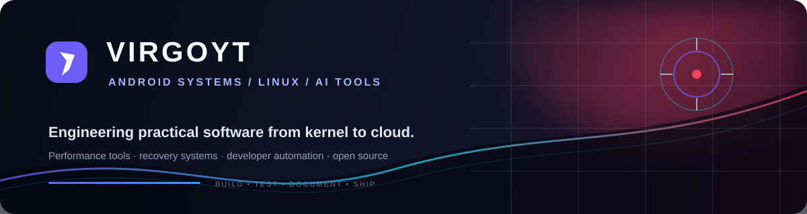

 

<h1>VIRGOYT</h1>

<strong>ANDROID SYSTEMS  ·  LINUX  ·  AI TOOLS</strong>

<code>Independent developer building practical software from kernel to cloud.</code>

---

<h2>✦ WHO I AM</h2>

**Android Kernel Developer · Linux Enthusiast · Open-Source Creator**

I build across the system boundary: **device kernels, recovery environments, Android performance tools, cloud services, and AI developer workflows**. My goal is simple—make complex systems more useful, testable, and understandable.

> `BUILD` → `TEST` → `DOCUMENT` → `SHIP`

---

<h2>⚡ SIGNATURE BUILDS</h2>

<table>
<tr>
<td width="50%" valign="top">

<h3>01 · VIRGOYT CLOUD AI</h3>

Prompt-driven AI workspace for agent tasks, code generation, project files, terminal output, diff review, and downloadable artifacts.

<a href="https://github.com/darkvirgoyt-beep/VirgoYT-AI"><code>OPEN PROJECT ↗</code></a>

  

<code>KOTLIN</code> <code>ANDROID</code> <code>COMPOSE</code> <code>AI</code>

</td>
<td width="50%" valign="top">

<h3>02 · FOGOS PERFORMANCE</h3>

Android tools and kernel profiles for supported Motorola and SM6375 devices, with a focus on practical tuning and control.

<a href="https://github.com/darkvirgoyt-beep/FogOS-Manager"><code>OPEN PROJECT ↗</code></a>

  

<code>KOTLIN</code> <code>ANDROID</code> <code>KERNEL</code>

</td>
</tr>
<tr>
<td width="50%" valign="top">

<h3>03 · KERNEL / RECOVERY</h3>

Custom gaming-kernel and Android recovery work for the Motorola fogos device family.

<a href="https://github.com/darkvirgoyt-beep/Motorola-g45-34-gaming-kernel-Fogos-new"><code>KERNEL ↗</code></a> · <a href="https://github.com/darkvirgoyt-beep/moto-g45-fogos-android17-recovery"><code>RECOVERY ↗</code></a>

  

<code>C</code> <code>C++</code> <code>LINUX</code> <code>ANDROID</code>

</td>
<td width="50%" valign="top">

<h3>04 · VIRGOCLOUD</h3>

TypeScript cloud control-plane and Docker node-agent experiment for Minecraft hosting infrastructure.

<a href="https://github.com/darkvirgoyt-beep/VirgoCloud"><code>OPEN PROJECT ↗</code></a>

  

<code>TYPESCRIPT</code> <code>DOCKER</code> <code>CLOUD</code>

</td>
</tr>
</table>

---

<h2>◈ THE ARSENAL</h2>

  

  

 

<code>ANDROID</code> <code>KOTLIN</code> <code>C/C++</code> <code>LINUX</code> <code>TYPESCRIPT</code> <code>DOCKER</code> <code>AI WORKFLOWS</code>

---

<h2>▣ CURRENTLY BUILDING</h2>

| SYSTEM | DIRECTION |
|:---|:---|
| **VirgoYT Cloud AI** | A serious AI workspace with chat, agent execution, file review, build output, and artifact delivery. |
| **Android Performance** | Device-aware kernel profiles, gaming optimization, and safer system utilities. |
| **Recovery / Device Work** | Reproducible recovery experiments and Motorola fogos-family development. |
| **Open-Source Quality** | Better documentation, CI, release notes, compatibility checks, and clear limitations. |

---

<h2>◉ GITHUB SIGNAL</h2>

  

---

<h2>⌁ CONNECT WITH VIRGOYT</h2>

<h2>⌁ ENGINEERING NOTE</h2>

For device and kernel work, **compatibility and recovery instructions come before marketing**. For AI and cloud work, **secrets stay server-side, actions remain reviewable, and generated artifacts are validated before delivery**.

---

<h2>LET'S BUILD SOMETHING USEFUL.</h2>

  

VIRGOYT SYSTEMS LAB  ·  BUILDING IN PUBLIC

